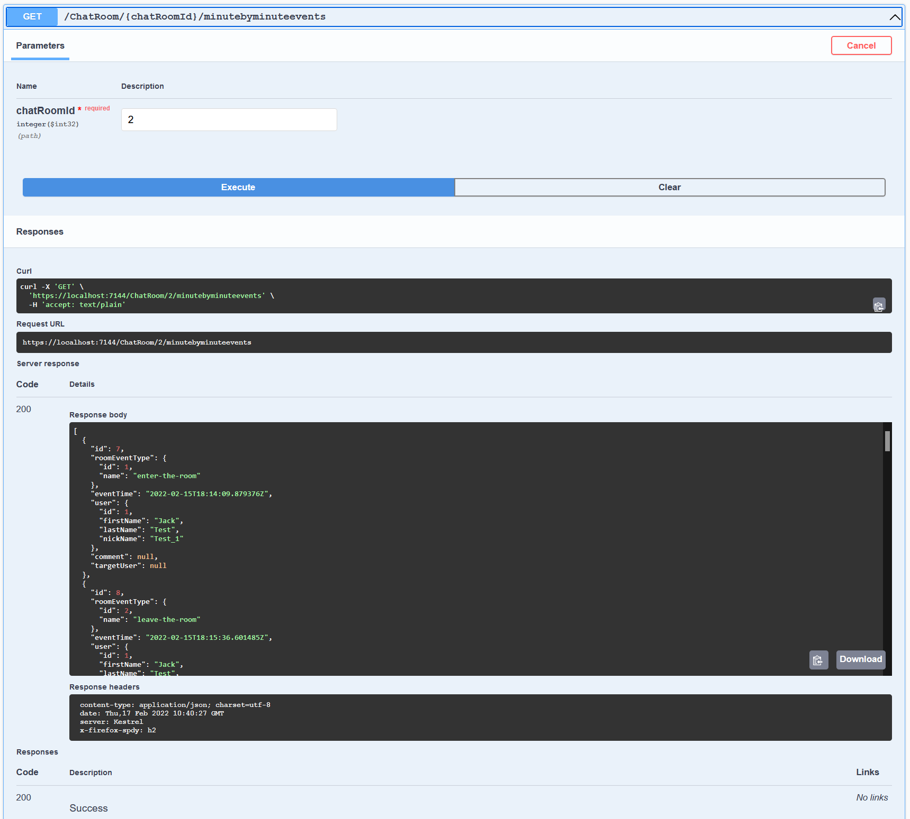
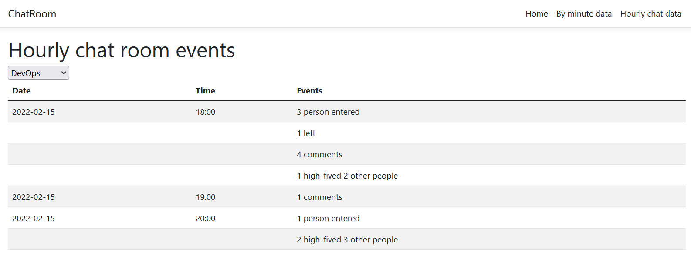

# ChatRoom
This application is a test for chat room information display for one of my assignments. It's not a whole fully working application. Below is the description what was implemented and how one can try out the functionality

# Solution setup and used technologies #

The initial solution was generaetd by Visual Studio as an Angular project template. It consted a C# backend project and and Angular client application inside that. Additional projects were added later for domain logic and documentation purposes. The final folder structure looks like this now.

## Folder strucure ##

- `ChatRoom` - The main C# backend application folder.
- `ChatRoom/ClientApp` - The Angular web client.
- `ChatRoom/Controllers` - The REST API controllers that contain the application endpoints used to generate test data and to view application endpoints working also.
- `ChatRoom.Tests` - Unet tests for the main `ChatRoom` application code.
- `BusinessLogic` - Application domain business logic code.
- `BusinessLogic.Tests` - Unit tests for the application business logic code inside the `BusinessLogic` folder.
- `Common` - Project for the cross-project DTO classes.
- `Repository` - Database access layer

## Used technologies, libraries ##

- **C# .NET Core** for the backend implementation. The backend provides _REST API_ end points for front end cummunication. The REST APIs return infomration in standard JSON format.
- **xUnit** with **FluentAssertions**  and **NSubstitute** were used for writing the backend unit tests.
- **Entiry Framework Core** and **Npgsql** was used to access the underlying PostgreSql database using _code first_ approach and _migrations_ for database updates.
- **Angular**_ is used for the client side implementation.
- **Swagger** is used for visual representationa of the REST API end points and for generating test data through the generated Swagger UI.
- **PostgreSQL** is used as the solution backend database.

# Application usage #

## Test data generation ##

To actually be able to validate that the chat room activity display works as described in the task description, we need test data. To provide a relatively easy way to generate that test data I created a few REST API end points that make it possible to generate chat rooms, users, and some user activity into the application's database. One can use the Swagger UI to pass in data to those REST APIs and generate test data.

These end point just some quick solutions for data generation, so for proper connections one still need to know object IDs at some places.

When one runs the solution from Visual Studio the Swagger UI is available from this url: [Swagger UI](https://localhost:7144/swagger/index.html ) 

### User creation ###

There is a PUT `/User` end point which you can use to generate or update chat room users. Below is a screenshot of a new user generation operation.

 

If you want you can also update existing users through this end point usign also the ID of a user in the submitted JSON:

```js
{
  "id": 5,
  "firstName": "Gabor",
  "lastName": "Nagy",
  "nickName": "Nagyika"
}
```


### Chat room creation ###

There is a PUT `/ChatRoom` end point which you can use to generate or update chat rooms. Below is a screenshot of a new room generation operation.

 

If you want you can also update existing chat rooms through this end point usign a more detailed JSON in the PUT request similar to this one:

```js
{
  "chatRoomId": 0,
  "name": "string",
  "createdById": 0,
  "createBy": {
    "id": 0,
    "firstName": "string",
    "lastName": "string",
    "nickName": "string"
  },
  "creatoinTime": "2022-02-17T10:08:25.357Z"
}
```
### Generate room event ###

There is one more REST API end point in the Swagger view, that can be used to generate the 4 specified type of chat room events. This is POST request under the path: `/ChatRoom/{chatRoomId}/user/{userId}/eventtype/{eventTypeId}`. Below is a screenshot of the use of this end point.


The three main data input which is always needed are in the URL here: `chatRoomId`, `userId` and `eventTypeId`. There are other two data members in the posted JSON body, which are not always needed. The `comment` is only used for a _comment_ type event, in which case this is the text submitted by the user. The `highFivedUserId` is needed for the _high-five-another-user_  type events to specify the user to be high-fived.

```js
{
  "highFivedUserId": 0,
  "comment": "string"
}
```

## Room event data source ##

There are two REST API end points to get the data needed for displaying the room events in the specified two ways: minute-by-minute or in an hourly bases. These are available under the `/ChatRoom/{chatRoomId}/minutebyminuteevents` and `/ChatRoom/{chatRoomId}/hourlyevents` paths respectively. Both expect the chat room to be specified with its ID and returns the data for the specified chat room. There are now additional filtering here at the moment for date for example, so it'll just return everything form the DB. In a real-life scenarion surley additional filtering is needed to limit the data returned by default (eg. return the last 100 items for example, or filter by some default date interval).

Below are just two screenshot of these end points from Swagger.

 

 


## View chat room events ##

The Angular based client application is the real front end for the requested display of the data. This can be reached with this URL [https://localhost:44442/](https://localhost:44442/ ). It willstart up in your default browser automatically in the browser when one runs tha application from Visual Studio.

I kept the main landing page of the generated Angular client, and added two links to the top right corner of the page for the minute-by-minute and for the hourly event view:

 

With the links you can reach the two views where the data displayed according the requirements provided. Both page contains a dropdown list at the top of the page, where one can select the chat room of interest for which the data should be displayed.

The minute-by-minute view contains every single event.

 

The hourly view contains aggregate information by the hour.

 


